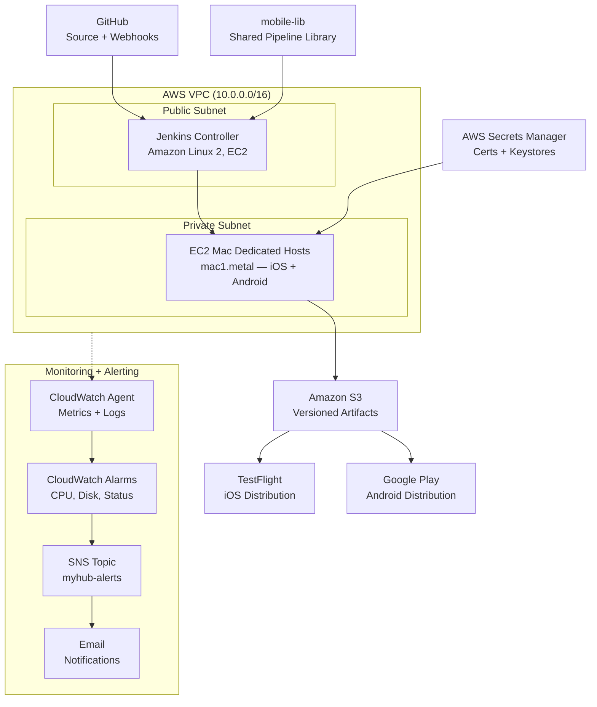

# BuildStream

**A scalable reference architecture for enterprise mobile CI/CD on AWS**

BuildStream is an open-source Mobile Build Accelerator that delivers production-grade iOS and Android applications through a fully automated pipeline on AWS. It solves the core challenge facing US enterprises today: building reliable, secure, and scalable mobile delivery infrastructure without vendor lock-in.

---

## The problem

Mobile application delivery at enterprise scale is fundamentally harder than web deployment. iOS builds require macOS hardware. Android builds require specific SDK toolchains. Code signing demands rigorous secret management. Distribution spans multiple gated platforms — App Store, Google Play, TestFlight — each with its own API, credential model, and approval flow.

Most organizations solve this with fragile, manually maintained build servers that become single points of failure. Engineers waste hours debugging signing issues, managing certificates by hand, and waiting for builds on shared infrastructure. The result: slow release cycles, inconsistent build quality, and security gaps in how signing credentials are handled.

BuildStream eliminates these problems by providing a complete, automated, and reproducible mobile build infrastructure on AWS.

---

## Architecture



The system consists of six layers:

**Source control and triggering** — GitHub repositories with webhook integration trigger Jenkins pipelines on every push. A GitFlow branching strategy controls which pipeline stages execute: feature branches build and test only, while main branch deployments go through signing and distribution.

**CI/CD orchestration** — A Jenkins controller running on Amazon EC2 (Amazon Linux 2) orchestrates pipeline execution. A shared pipeline library centralizes all build logic so that any mobile application integrates with a three-line Jenkinsfile.

**Build infrastructure** — EC2 Mac Dedicated Hosts (`mac1.metal`) in a private subnet execute iOS builds (Xcode, xcodebuild, fastlane) and Android builds (Gradle, Android SDK). Agents are bootstrapped automatically — a replacement agent is production-ready on first boot with no manual intervention.

**Secret management** — Apple certificates, provisioning profiles, and Android keystores are stored in AWS Secrets Manager. Credentials are pulled at build time, used for signing, and destroyed immediately after. No signing secrets persist on any build agent.

**Artifact storage and distribution** — Signed artifacts (IPA for iOS, AAB for Android) are uploaded to versioned S3 paths. Distribution to TestFlight and Google Play is handled via fastlane on release branches.

**Monitoring and alerting** — CloudWatch agents on Jenkins and Mac build agents report system metrics. CloudWatch Alarms trigger on health thresholds and route through SNS to email notifications.

---

## Repository guide

BuildStream is organized into three repositories plus this umbrella. Each has a distinct role:

### buildstream (this repository)
The project overview and infrastructure documentation. Start here to understand the architecture and provision the AWS foundation. Contains the architecture diagram, the [infrastructure setup guide](docs/infrastructure-setup.md), and integration guides for Bitbucket and UrbanCode Deploy.

### [mobile-lib](https://github.com/Santoshkumarpuppala/mobile-lib)
The shared pipeline library and heart of BuildStream. This is where the pipeline logic lives — platform routing, iOS and Android build stages, secret handling, and notifications. Start here to understand how the pipeline works or to integrate your own application.

Register it in Jenkins as a Global Pipeline Library:

```
Manage Jenkins → Configure System → Global Pipeline Libraries → Add
Name: mobile-lib
Default version: main
Retrieval method: Modern SCM (Git)
Repository URL: https://github.com/Santoshkumarpuppala/mobile-lib.git
```

### [myhub-ios](https://github.com/Santoshkumarpuppala/myhub-ios)
A working iOS reference application. Shows how an iOS app integrates with BuildStream end to end. The entire CI/CD integration is three lines:

```groovy
@Library('mobile-lib') _

mobilePipeline(platform: 'ios', appName: 'MyHub')
```

Clone and explore locally:

```bash
git clone https://github.com/Santoshkumarpuppala/myhub-ios.git
cd myhub-ios && pod install && open MyHub.xcworkspace
```

### [myhub-android](https://github.com/Santoshkumarpuppala/myhub-android)
A working Android reference application — the Android counterpart showing Gradle build, AAB signing, and Google Play distribution. Same three-line integration pattern:

```groovy
@Library('mobile-lib') _

mobilePipeline(platform: 'android', appName: 'MyHub')
```

Clone and explore locally:

```bash
git clone https://github.com/Santoshkumarpuppala/myhub-android.git
cd myhub-android && ./gradlew test
```

---

## Getting started

Follow this order to understand and deploy BuildStream:

**1. Understand the architecture** — Read this README and review the [architecture diagram](docs/architecture.png) to understand how the layers fit together.

**2. Provision the AWS infrastructure** — Follow the [infrastructure setup guide](docs/infrastructure-setup.md) to stand up the VPC, Jenkins controller, EC2 Mac build agents, S3 bucket, and Secrets Manager entries.

**3. Set up the shared library** — Register [mobile-lib](https://github.com/Santoshkumarpuppala/mobile-lib) as a Global Pipeline Library in Jenkins (instructions in that repo's README).

**4. Run a reference pipeline** — Create a Jenkins pipeline job pointing at [myhub-ios](https://github.com/Santoshkumarpuppala/myhub-ios) or [myhub-android](https://github.com/Santoshkumarpuppala/myhub-android) and trigger a build to see the full flow execute.

**5. Integrate your own app** — Add the three-line Jenkinsfile to any mobile application and it inherits the entire pipeline.

---

## Technical stack

| Layer | Technology |
|---|---|
| Source control | GitHub (Bitbucket-compatible — see [migration guide](docs/bitbucket.md)) |
| CI/CD engine | Jenkins (pipeline-as-code, shared libraries) |
| Build agents | EC2 Mac Dedicated Hosts (mac1.metal) |
| iOS toolchain | Xcode, xcodebuild, fastlane, CocoaPods |
| Android toolchain | Gradle, Android SDK, jarsigner |
| Infrastructure | AWS VPC, EC2, IAM, Security Groups |
| Secret management | AWS Secrets Manager |
| Artifact storage | Amazon S3 (versioned) |
| Monitoring | CloudWatch Agent, CloudWatch Alarms, SNS |
| Distribution | TestFlight (fastlane pilot), Google Play (fastlane supply) |

---

## Security model

**Network isolation** — Build agents run in a private subnet with no public internet access. Only the Jenkins controller can reach agents via SSH. Security groups enforce port-level access control.

**Ephemeral credentials** — Signing certificates and keystores are pulled from AWS Secrets Manager at build time, used for the signing operation, and destroyed immediately after. No credential material persists on any build agent between builds.

**IAM scoping** — Jenkins and build agents operate under separate IAM roles with least-privilege policies scoped to specific S3 buckets and Secrets Manager paths.

---

## Key design decisions

**Why Jenkins shared libraries over per-repo pipelines** — Centralizing pipeline logic means improvements deploy to every application simultaneously. Individual app teams maintain a three-line Jenkinsfile and never touch CI/CD configuration. This scales to dozens of mobile applications without pipeline drift.

**Why EC2 Mac Dedicated Hosts over third-party CI** — Running builds on AWS infrastructure provides full control over the build environment, eliminates vendor lock-in, and keeps signing credentials within the organization's AWS account boundary.

**Why ephemeral credentials over stored certificates** — Signing keys are the most sensitive assets in mobile delivery. The pull-use-destroy pattern limits credential exposure to the duration of a single build.

**Why S3 over artifact registries** — S3 provides versioned, durable artifact storage with native IAM integration and no additional infrastructure to manage.

---

## Documentation

| Document | Description |
|---|---|
| [Infrastructure setup guide](docs/infrastructure-setup.md) | Full AWS provisioning — VPC, Jenkins, Mac agents, Secrets Manager |
| [Bitbucket migration guide](docs/bitbucket.md) | Switching from GitHub to Bitbucket with zero pipeline changes |
| [UCD integration guide](docs/ucd-integration.md) | Publishing BuildStream artifacts into IBM UrbanCode Deploy |

---

## Author

**Santosh Kumar Puppala**  
Senior DevOps / Site Reliability Engineer

- AWS Certified Solutions Architect — Associate
- Microsoft Certified Azure Administrator Associate
- Certified Kubernetes Administrator (CKA)
- M.S. in Cybersecurity, Villanova University

---

## License

MIT License — see [LICENSE](LICENSE) for details.
