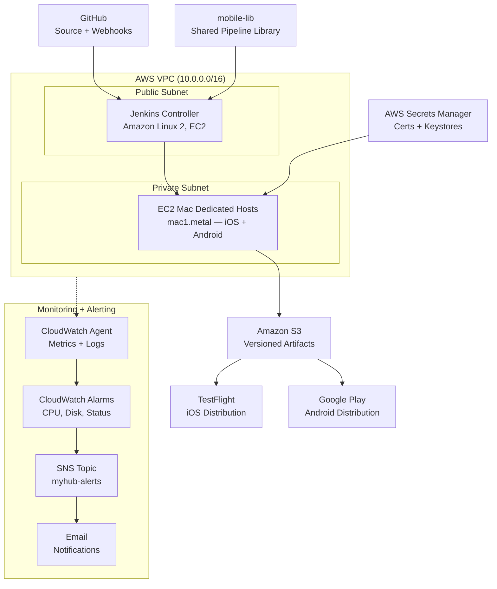

# BuildStream Architecture

The diagram below shows all six layers of the BuildStream system: source control, CI/CD orchestration, build infrastructure, secret management, artifact storage and distribution, and monitoring.

> **Note:** `architecture.png` (referenced in the root README) is the exported version of this diagram. To regenerate it, paste the Mermaid source below into [mermaid.live](https://mermaid.live), export as PNG at 2x resolution, and save to `docs/architecture.png`.

---

---

## Layer descriptions

| Layer | Components | Purpose |
|---|---|---|
| Source control | GitHub, webhooks | Trigger pipelines on push; branch strategy gates stage execution |
| CI/CD orchestration | Jenkins controller (EC2, public subnet) | Receive webhook, schedule builds, load `mobile-lib`, report status |
| Build infrastructure | EC2 Mac Dedicated Hosts (private subnet) | Execute Xcode and Gradle builds; apply signing; upload to S3 |
| Secret management | AWS Secrets Manager | Store certificates and keystores; expose only to build agents via IAM |
| Artifact storage | Amazon S3 (versioned) | Retain signed IPAs and AABs; structured path enables traceability |
| Distribution | TestFlight, Google Play | Deliver signed artifacts to testers (iOS) and app store (Android) |
| Monitoring | CloudWatch Agent, Alarms, SNS | Alert on agent health; forward build logs for audit |

## Key data flows

**Build trigger:** GitHub push → webhook → Jenkins controller (port 8080, public subnet)

**Pipeline execution:** Jenkins controller → SSH → Mac agent (private subnet, port 22 only from Jenkins SG)

**Secret access:** Mac agent IAM role → Secrets Manager → credentials pulled at signing time, destroyed after

**Artifact delivery:** Mac agent → S3 PUT → (on main branch) fastlane → TestFlight / Google Play

**Health alerting:** CloudWatch Agent on every instance → CloudWatch Alarms → SNS → email
