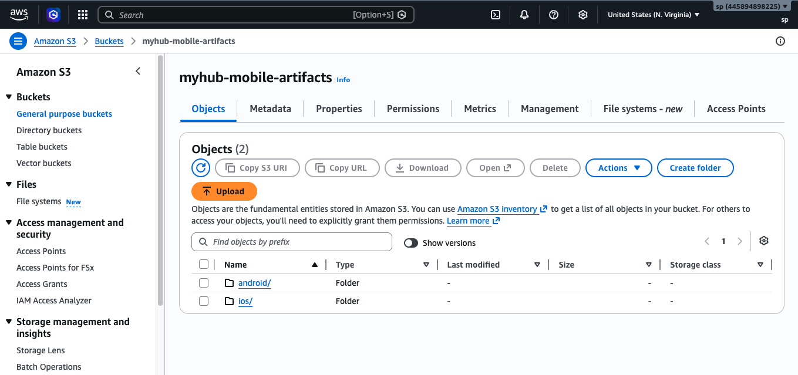
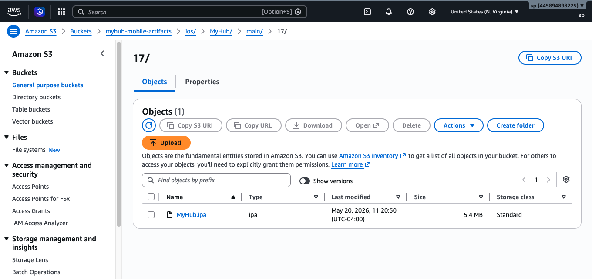
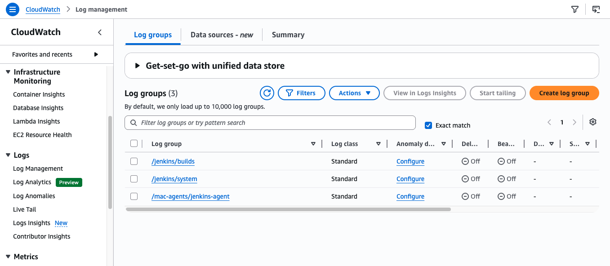
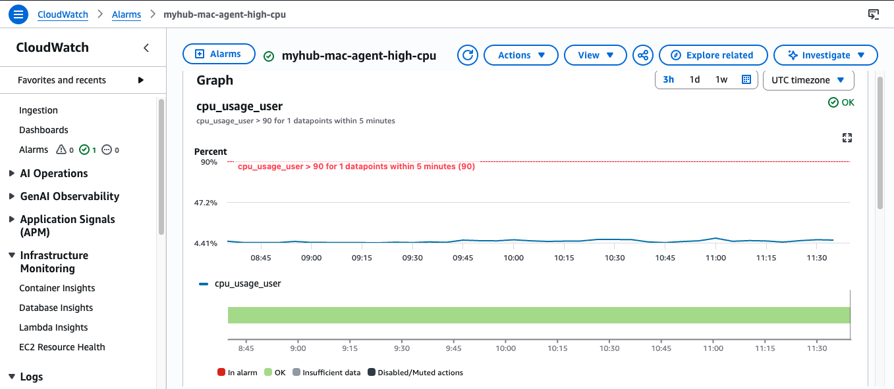

# Infrastructure Setup Guide

This guide provisions the complete AWS foundation for BuildStream: networking, the Jenkins controller, EC2 Mac build agents, secret storage, artifact storage, and monitoring.

---

## Prerequisites

- AWS account with permissions to create VPC, EC2, IAM, S3, Secrets Manager, and CloudWatch resources
- An EC2 key pair for SSH access
- A GitHub account with a personal access token (Contents, Metadata, Webhooks, Administration permissions)
- An Apple Developer account (for iOS signing assets)
- An Android keystore (for Android signing)

---

## 1. Networking (VPC)

Create an isolated network with a public subnet for the Jenkins controller and a private subnet for the Mac build agents.

| Resource | Configuration |
|---|---|
| VPC | CIDR `10.0.0.0/16` |
| Public subnet | `10.0.1.0/24` — Jenkins controller |
| Private subnet | `10.0.2.0/24` — Mac build agents |
| Internet Gateway | Attached to VPC |
| Public route table | Route `0.0.0.0/0` to Internet Gateway, associated with public subnet |
| Private route table | No internet route, associated with private subnet |

### Security groups

**Jenkins security group**

| Port | Protocol | Source | Purpose |
|---|---|---|---|
| 22 | TCP | Administrator IP | SSH access |
| 8080 | TCP | Administrator IP | Jenkins web UI |

**Mac agent security group**

| Port | Protocol | Source | Purpose |
|---|---|---|---|
| 22 | TCP | Jenkins security group | SSH from Jenkins only |

The Mac agents accept no public inbound traffic. Only the Jenkins controller can reach them.

---

## 2. Jenkins controller

Launch the Jenkins controller on EC2.

| Setting | Value |
|---|---|
| AMI | Amazon Linux 2 |
| Instance type | t3.medium |
| Subnet | Public subnet |
| Public IP | Enabled |
| Security group | Jenkins security group |
| Storage | 30 GB gp3 |

### IAM role

Create an instance role (`jenkins-controller-role`) with an inline policy granting least-privilege access:

```json
{
  "Version": "2012-10-17",
  "Statement": [
    {
      "Sid": "ArtifactBucket",
      "Effect": "Allow",
      "Action": ["s3:PutObject", "s3:GetObject", "s3:ListBucket"],
      "Resource": [
        "arn:aws:s3:::myhub-mobile-artifacts",
        "arn:aws:s3:::myhub-mobile-artifacts/*"
      ]
    },
    {
      "Sid": "SecretsManagerRead",
      "Effect": "Allow",
      "Action": ["secretsmanager:GetSecretValue"],
      "Resource": [
        "arn:aws:secretsmanager:us-east-1:*:secret:ios/*",
        "arn:aws:secretsmanager:us-east-1:*:secret:android/*"
      ]
    },
    {
      "Sid": "CloudWatchAgentWrite",
      "Effect": "Allow",
      "Action": [
        "cloudwatch:PutMetricData",
        "logs:CreateLogGroup",
        "logs:CreateLogStream",
        "logs:PutLogEvents"
      ],
      "Resource": "*"
    }
  ]
}
```

### Bootstrap (user data)

```bash
#!/bin/bash
yum update -y
yum install -y java-17-amazon-corretto git
wget -O /etc/yum.repos.d/jenkins.repo \
  https://pkg.jenkins.io/redhat-stable/jenkins.repo
rpm --import https://pkg.jenkins.io/redhat-stable/jenkins.io-2023.key
yum install -y jenkins
systemctl enable jenkins
systemctl start jenkins
```

Retrieve the initial admin password and complete the setup wizard:

```bash
sudo cat /var/lib/jenkins/secrets/initialAdminPassword
```

### Required plugins

- GitHub Integration
- SSH Agent
- Pipeline (with Declarative)
- Pipeline Graph View
- S3 Artifact
- CloudWatch Logs

---

## 3. EC2 Mac build agents

Mac builds require EC2 Mac Dedicated Hosts, which satisfy Apple's macOS licensing requirements.

### Allocate Dedicated Hosts

| Setting | Value |
|---|---|
| Instance family | mac1 |
| Instance type | mac1.metal |
| Availability Zone | Match the private subnet AZ |

> **Note:** Dedicated Hosts carry a 24-hour minimum allocation period. Plan accordingly before releasing.

### Launch Mac instances

| Setting | Value |
|---|---|
| AMI | macOS (latest available) |
| Instance type | mac1.metal |
| Subnet | Private subnet |
| Public IP | Disabled |
| Security group | Mac agent security group |
| Storage | 200 GB gp3 |
| IAM role | Mac agent role (S3, Secrets Manager, CloudWatch) |

#### Mac agent IAM role

Create `mac-agent-role` with the same S3 and Secrets Manager policy as the Jenkins controller role above. Mac agents write artifacts and read secrets independently of the controller.

### Agent bootstrap

Provision the build toolchain automatically on each agent via the instance user data or a provisioning script:

```bash
#!/bin/bash
# Homebrew
/bin/bash -c "$(curl -fsSL https://raw.githubusercontent.com/Homebrew/install/HEAD/install.sh)"

# iOS toolchain
xcode-select --install
brew install rbenv ruby-build
rbenv install 3.2.0 && rbenv global 3.2.0
gem install fastlane cocoapods

# Android toolchain
brew install --cask android-commandlinetools
yes | sdkmanager --licenses
sdkmanager "platform-tools" "platforms;android-34" "build-tools;34.0.0"
export ANDROID_HOME=~/Library/Android/sdk
echo 'export ANDROID_HOME=~/Library/Android/sdk' >> ~/.zshrc
echo 'export PATH=$ANDROID_HOME/platform-tools:$PATH' >> ~/.zshrc
brew install gradle

# Java (required for Gradle and Jenkins agent JAR)
brew install openjdk@21
sudo ln -sfn /usr/local/opt/openjdk@21/libexec/openjdk.jdk \
  /Library/Java/JavaVirtualMachines/openjdk-21.jdk

# CloudWatch agent
brew install amazon-cloudwatch-agent

# Jenkins agent working directory
mkdir -p ~/jenkins-agent
```

### Register agents in Jenkins

For each agent: **Manage Jenkins → Nodes → New Node**

| Setting | Value |
|---|---|
| Type | Permanent Agent |
| Remote root | `/Users/ec2-user/jenkins-agent` |
| Labels | `mac-agent` |
| Launch method | Launch agents via SSH |
| Host | Agent private IP |
| Credentials | SSH key pair (add in Jenkins Credentials store) |

Agents sharing the `mac-agent` label are load-balanced automatically by Jenkins. Add additional agents to the same label to scale build throughput horizontally.

---

## 4. Secret management (Secrets Manager)

Store all signing assets in AWS Secrets Manager. Encode binary assets (certificates, keystores) as base64 before storing.

| Secret name | Type | Field | Description |
|---|---|---|---|
| `ios/apple-p12-cert` | SecretString (JSON) | `certificate` | Base64-encoded Apple .p12 certificate |
| `ios/apple-p12-password` | SecretString (JSON) | `password` | Certificate export password |
| `ios/provisioning-profile` | SecretString (JSON) | `profile` | Base64-encoded .mobileprovision file |
| `android/keystore` | SecretString (JSON) | `keystore` | Base64-encoded .jks keystore |
| `android/keystore-password` | SecretString (JSON) | `password` | Keystore password |
| `android/key-alias` | SecretString (JSON) | `alias` | Signing key alias |
| `android/key-password` | SecretString (JSON) | `password` | Key password |

#### Encoding a binary asset for storage

```bash
# Encode a .p12 certificate
base64 -i /path/to/cert.p12 | tr -d '\n' > cert_b64.txt

# Store in Secrets Manager as JSON
aws secretsmanager create-secret \
  --name ios/apple-p12-cert \
  --secret-string "{\"certificate\": \"$(cat cert_b64.txt)\"}"

# Remove the local encoded copy
rm cert_b64.txt
```

The pipeline pulls these at build time and destroys all local copies after signing. See the `sign()` methods in [mobile-lib/src/com/test/mobile/](https://github.com/Santoshkumarpuppala/mobile-lib/tree/main/src/com/test/mobile) for the implementation.

---

## 5. Artifact storage (S3)

Create a versioned S3 bucket for build artifacts.

| Setting | Value |
|---|---|
| Bucket name | `myhub-mobile-artifacts` |
| Region | Match the VPC region (`us-east-1`) |
| Public access | Blocked |
| Versioning | Enabled |
| Encryption | SSE-S3 |

Artifacts are stored under a structured path that encodes platform, application, branch, and build number:

```
s3://myhub-mobile-artifacts/<platform>/<app>/<branch>/<build_number>/<app>.<ext>

# Example — iOS main branch build #42
s3://myhub-mobile-artifacts/ios/MyHub/main/42/MyHub.ipa

# Example — Android feature branch build #17
s3://myhub-mobile-artifacts/android/MyHub/feature-login/17/MyHub.aab
```

This structure supports artifact archaeology (retrieve any specific build), retention policies per branch, and automated cleanup of stale feature-branch artifacts via S3 lifecycle rules.

#### Recommended lifecycle rules

| Prefix | Expiration |
|---|---|
| `*/main/*` | Never (retain all release artifacts) |
| `*/feature-*/*` | 30 days |
| `*/hotfix-*/*` | 90 days |

The S3 bucket is confirmed live with both platforms active. Artifacts from real pipeline runs are present in the documented path structure:



iOS pipeline build #17 produced `MyHub.ipa` (5.4 MB) at `ios/MyHub/main/17/`:



Android pipeline build #5 produced `MyHub.aab` (20.7 MB) at `android/MyHub/main/5/`:


---

## 6. Monitoring (CloudWatch)

### CloudWatch agent

Install the CloudWatch agent on the Jenkins controller and each Mac agent. The agent collects CPU, memory, and disk metrics and forwards application logs to CloudWatch Logs.

Configuration file (`/opt/aws/amazon-cloudwatch-agent/etc/amazon-cloudwatch-agent.json`):

```json
{
  "logs": {
    "logs_collected": {
      "files": {
        "collect_list": [
          {
            "file_path": "/var/log/jenkins/jenkins.log",
            "log_group_name": "/jenkins/system",
            "log_stream_name": "{instance_id}"
          }
        ]
      }
    }
  },
  "metrics": {
    "metrics_collected": {
      "cpu": { "measurement": ["cpu_usage_idle", "cpu_usage_user"] },
      "mem": { "measurement": ["mem_used_percent"] },
      "disk": { "measurement": ["disk_used_percent"], "resources": ["/"] }
    }
  }
}
```

### Log groups

| Log group | Source | Retention |
|---|---|---|
| `/jenkins/system` | Jenkins controller | 30 days |
| `/jenkins/builds` | Jenkins build logs | 30 days |
| `/mac-agents/jenkins-agent` | Mac agent logs | 30 days |

All three log groups are confirmed active in the deployed BuildStream environment:



These log groups are created automatically by the CloudWatch agent on first startup. If they do not appear, check the CloudWatch agent configuration file and IAM permissions on the instance role.

### Alarms

| Alarm | Metric | Condition | Action |
|---|---|---|---|
| Mac agent high CPU | `cpu_usage_user` | > 90% for 5 min | SNS → email |
| Mac agent high disk | `disk_used_percent` | > 80% | SNS → email |
| Jenkins high CPU | `CPUUtilization` | > 80% for 10 min | SNS → email |
| Jenkins EC2 status check | `StatusCheckFailed` | ≥ 1 for 2 min | SNS → email |

The `myhub-mac-agent-high-cpu` alarm monitors `cpu_usage_user` on the Mac build agent. Normal iOS builds peak at 60–80% CPU during compilation but drop immediately after. The 90% threshold is calibrated to detect a genuinely stuck or runaway process, not a healthy build spike:



The alarm is in **OK** state (green checkmark). CPU sits at 4–5% while the agent is idle between builds — well below the 90% alarm threshold. This confirms the CloudWatch agent is actively shipping metrics from the Mac Dedicated Host to AWS.

### SNS topic

```bash
# Create topic
aws sns create-topic --name myhub-alerts

# Subscribe an email address
aws sns subscribe \
  --topic-arn arn:aws:sns:us-east-1:<account-id>:myhub-alerts \
  --protocol email \
  --notification-endpoint your@email.com
```

All alarms route through this topic. Confirm the subscription from your inbox before testing.

### Dashboard

Create a CloudWatch dashboard (`myhub-mobile-pipeline`) with widgets for:
- Jenkins controller CPU and memory
- Mac agent CPU and disk (one row per agent)
- Active alarm count

---

## Verification checklist

After completing all steps, confirm the following before running a real pipeline:

- [ ] Jenkins controller is reachable on port 8080
- [ ] Both Mac agents appear **online** in Jenkins → Nodes
- [x] A test shell step on a Mac agent resolves: `java`, `xcodebuild`, `fastlane`, `gradle`, `aws` — **verified** via `mac-agent-verify` pipeline (Verify Tools stage, Build #3)
- [x] `aws secretsmanager list-secrets` returns the expected secret names from the Mac agent — **verified**: `ios/apple-p12-cert`, `ios/apple-p12-password`, `android/keystore` confirmed visible from `mac-mini-agent`
- [x] `aws s3 ls s3://myhub-mobile-artifacts/` succeeds from the Mac agent — **verified**: `android/` and `ios/` folders confirmed, `MyHub.ipa` (5.4 MB) at `ios/MyHub/main/17/`, `MyHub.aab` (20.7 MB) at `android/MyHub/main/5/`
- [x] CloudWatch log groups exist and are receiving data — **verified**: `/jenkins/builds`, `/jenkins/system`, `/mac-agents/jenkins-agent` all active (Standard class)
- [x] CloudWatch alarm is configured and operational — **verified**: `myhub-mac-agent-high-cpu` alarm in OK state, CPU metrics streaming from Mac agent
- [ ] A test SNS notification routes successfully to your email

Once verified, register the [mobile-lib](https://github.com/Santoshkumarpuppala/mobile-lib) shared library (see its README) and trigger a pipeline run against `myhub-ios` or `myhub-android`.

---

## Cost considerations

EC2 Mac Dedicated Hosts are the primary cost driver, billed at a minimum of 24 hours per allocation regardless of whether the Mac instance is running. The Jenkins controller (`t3.medium`) can be stopped when not in use at no additional cost beyond EBS storage. S3 and Secrets Manager costs are negligible at typical build volumes. Release Dedicated Hosts when build infrastructure is not needed for extended periods to halt host billing.
